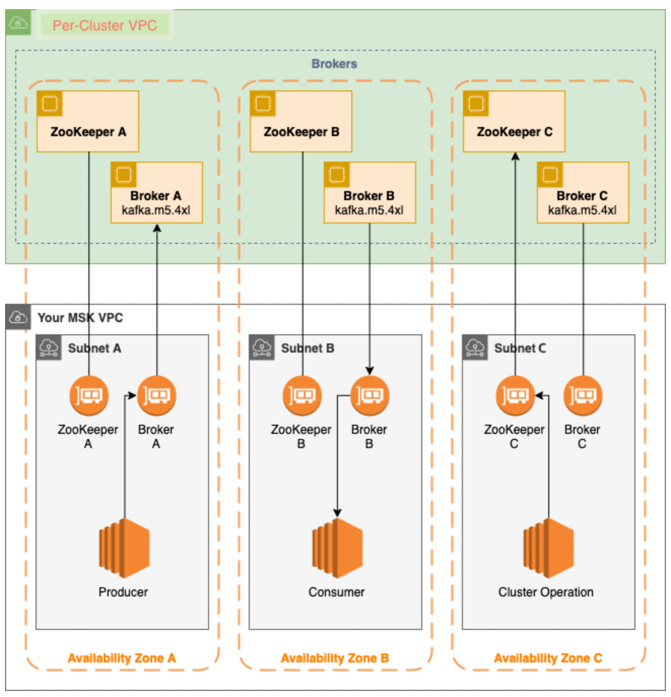

# MSK (Amazon Managed Streaming for Apache Kafka)

## MSK란?

- Apache Kafka를 사용하여 스트리밍 데이터를 처리하는 애플리케이션의 구축 및 실행을 지원하는 완전 관리형 서비스
- 클러스터 생성, 업데이트 및 삭제 등에 필요한 제어 영역 작업을 제공
- 데이터 생성 및 소비와 같은 Kafka 데이터 영역 작업을 사용할 수 있음

- 브로커노드 : MSK 클러스터 생성 시 각 가용 영역에 생성할 브로커 노드 수 지정 (각 가용영역에는 고유한 VPC 서브넷이 있음)
- ZooKeeper : 분산 조정을 지원하는 안정성이 뛰어난 오픈 소스 서버
- Producers / Consumers / Topic creators : Kafka 데이터 영역 작업을 사용하여 주제 생성, 데이터 생성 및 소비
- Cluster Operations : AWS CLI 또는 SDK에서 제어 영역 작업을 수행하는 API

MSK는 클러스터에 대한 가장 일반적인 결함 시나리오를 감지하고 자동으로 복구하므로 애플리케이션이 최소한의 영향을 받으면서 쓰기 및 읽기 작업을 계속할 수 있다.

## 클러스터 생성

### Amazon MSK 콘솔

- Custom create
- Cluster name : MSKTutorialCluster
- Apache Kafka version : 2.6.2(recommended)
- Broker type : kafka.t3.small
- Number of zones : 2
- Number of brokers per zone : 2
- EBS storage volume per broker : 3 GiB
- Cluster configuration : MSK default configuration
