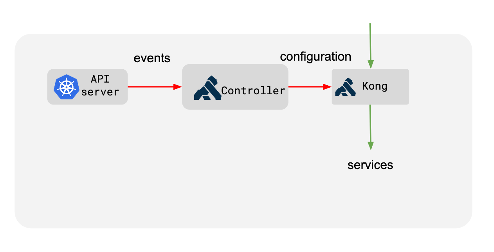
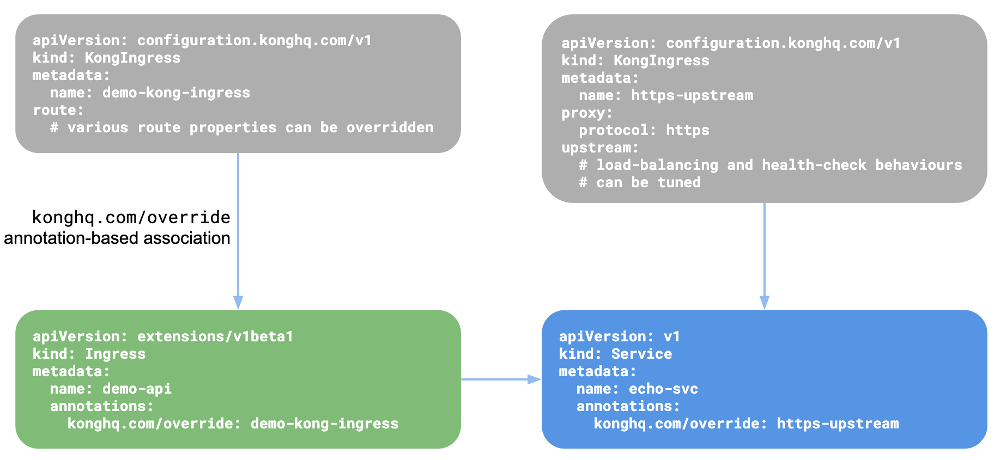
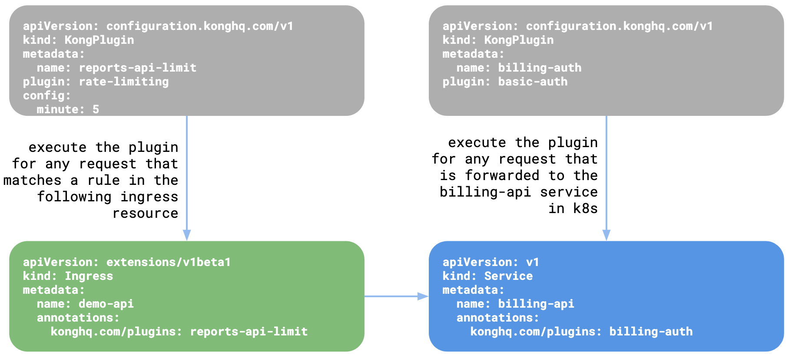
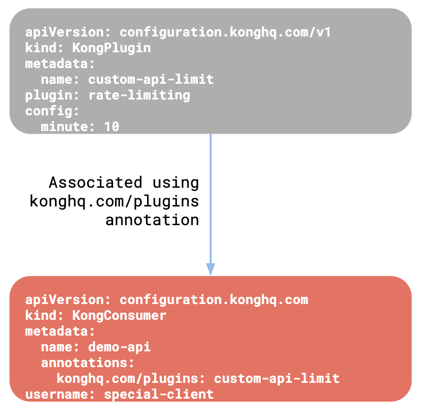

# Kong

## Kong?

[Kong-github](https://github.com/Kong/kong)

### Architecture - Kubernetes Ingress Controller Design

#### Overview

* 오픈소스 API Gateway
* 모든 트래픽을 처리하는 proxy 역할
* k8s ingress controller가 클러스터 내에 생성된 ingress resource를 사용하여 kong을 구성
* kong-controller가 k8s 클러스터 내에 발생하는 변경 사항을 수신하고 해당 변경에 따라 kong을 업데이트하여 모든 트래픽을 올바르게 프록시
* kong은 k8s 클러스터 내에서 발생하는 확장, 구성변경, 장애와 관련된 변화에 대응하기 위해 동적으로 업데이트

ingress: 클러스터 내의 서비스에 대한 외부 접근을 관리하는 API 오브젝트  
ingress controller: ingress rules를 실제로 작동하는 역할

#### Translation

모든 트래픽을 올바르게 프록시하기 위해 k8s 리소스가 kong 리소스에 매핑

##### k8s 리소스가 Kong 리소스에 매핑되는 방법

* k8s의 ingress 리소스는 트래픽을 프록시하기 위한 규칙을 정의 (kong의 route 개념과 일치)
* k8s의 서비스는 pods에서 실행중인 애플리케이션은 추상화하는 방법이며 이것이 kong의 service와 upstream 객체에 매핑됨
* kong의 서비스 객체는 upstream과 통신하는 데 사용할 프로토콜에 대한 정보 및 기타 설정을 보유
* upstream 개체는 load-balancing 및 health-checking을 정의
* k8s의 서비스와 연결된 pods은 kong의 upstream에 속하는 target으로 매핑
* kong load-balance는 서비스의 pods 간에 이루어짐
* kong을 통해 유입되는 모든 요청이 kube-porxy가 아닌 pod으로 직접 전달된다는 것을 의미

---

### Custom Resources

k8s의 custom resources는 컨트롤러가 특정 애플리케이션에 특화된 kubernetes-style 선언적 api를 확장할 수 있도록 한다. k8s ingress controller에 kong 관련 설정을 구성하고 프록시 동작을 세부적으로 제어할 수 있도록 몇 가지 사용자 지정 리소스가 번들로 제공된다. k8s ingress controller 는 configuration.konghq.com API 그룹을 사용하여 kong관련 구성을 저장한다. 다음의 CRD를 통해 kong의 모든 측면을 선언적으로 구성할 수 있다.

* KongIngress
* KongPlugin
* KongClusterPlugin
* KongConsumer
* TCPIngress
* UDPIngress

### KongIngress

k8s의 ingress 리소스는 상당히 모호한 API이며 프록시의 세부사항을 설명하는 리소스를 제공하지 않는다. 이러한 한계를 극복하기 위해 KongIngress Custom Resource는 기존 k8s ingress API의 확장으로 사용되어 프록시 동작을 세부적으로 제어한다. KongIngress는 기존 수신 리소스와 함께 동작하며 이 리소스를 확장한다. 이것은 k8s ingress resource를 대체하는 것이 아니다. KongIngress를 사용하여 수신 리소스와 관련된 upstream, service, route entities의 모든 속성을 수정할 수 있다.  
  
KongIngress 리소스가 생성되면 configuration.konghq.com annotation을 사용하여 KongIngress 리소스를 수신하거나 서비스 리소스에 연결할 수 있다.

* annotaion이 ingress 리소스에 추가되면 라우팅 구성이 업데이트 되고 annotation ingress와 관련된 모든 route가 KongIngress route의 섹션에 정의된 값을 사용하도록 업데이트 됨
* annotation이 k8s 서비스 리소스에 추가되면 KongIngress 리소스에 정의된 프록시 및 upstream 블록을 사용하도록 해당 서비스 및 Kong Upstream이 업데이트 됨

#### 리소스가 서로 연결되는 방식

### KongPlugin

Kong은 확장 가능한 플러그인 아키텍처 기반으로 설계 되었으며 다양한 플러그인이 포함되어있다. 이러한 플러그인은 request/response 수정 또는 트래픽 제한에 사용할 수 있다. 리소스가 생성되면 k8s의 ingress 또는 KongConsumer 리소스와 연결해야 한다.  
  
#### KongPlugin 리소스 수신 및 Service or KongConsumer 연결

### KongClusterPlugin

---

## Reference

* [Kong](https://docs.konghq.com/kubernetes-ingress-controller/)
* <https://phaesoo.me/blog/kong-for-k8s-1/>
* <https://bcho.tistory.com/1364>
