# Minikube start

***What you’ll need***

* **2 CPUs** or more
* **2GB** of free memory
* **20GB** of free disk space
* Internet connection
* Container or virtual machine manager, such as: **Docker**, Hyperkit, Hyper-V, KVM,  Parallels, Podman, VirtualBox, or VMware Fusion/Workstation

***설치환경***

* m1 macbook pro

## Minikube

### 사전 준비

* Docker 기초 -> [Docker for beginners](https://docker-curriculum.com/#getting-started)
* Kubernetes 기초 -> [초보를 위한 쿠버네티스 안내서](https://www.youtube.com/watch?v=Ia8IfowgU7s)
* Kubectl 설치 -> [Mac OS kubectl Homebrew 설치](https://kubernetes.io/ko/docs/tasks/tools/install-kubectl-macos/#install-with-homebrew-on-macos)

#### 1. Installation

```zsh
brew install minikube

# /usr/local/bin/minikube
which minikube 

# which minikube fails
brew unlink minikube
brew link minikube
```

#### 2. Start cluster

```zsh
minikube start --driver=docker
# or
# 기본 driver를 docker로 설정 / 실행 시 적용
minikube config set driver docker
minikube start 
```

*Minikube run*
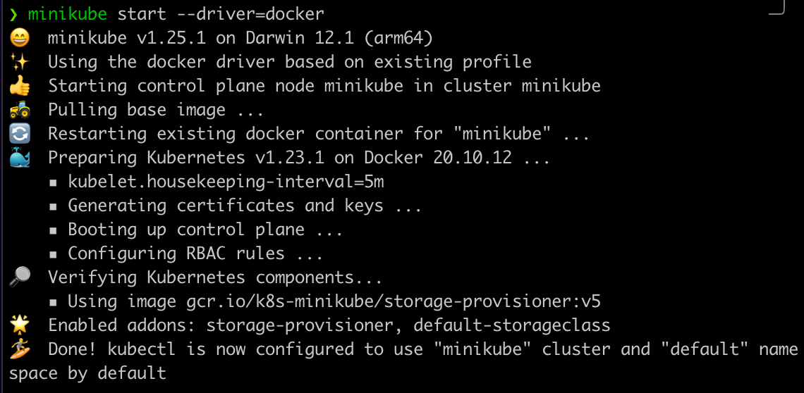

*Docker run*


#### 3. Cluster 상호작용

```zsh
# 리소스 목록에서 모든 pod 정보 확인 
kubectl get po -A
```

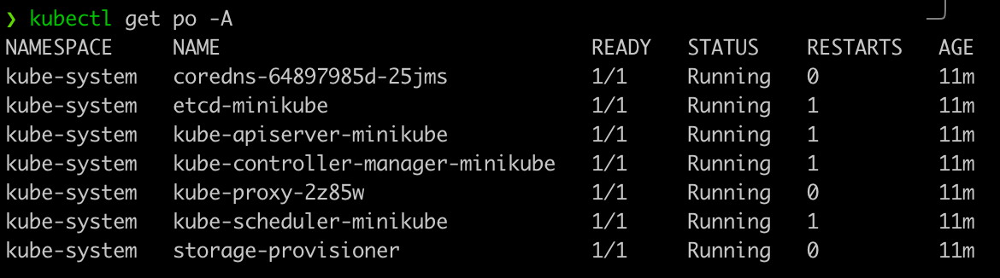

```zsh
# minikube 리소스 목록에서 모든 pod 정보 확인 
minikube kubectl -- get po -A
```

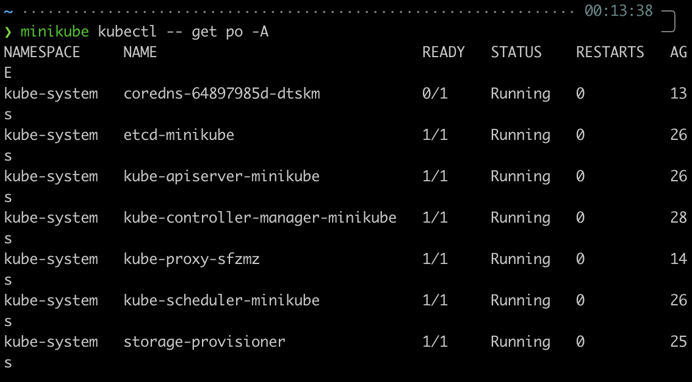

```zsh
# Dashboard 지원
minikube dashboard
```

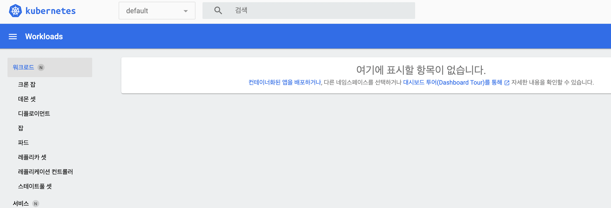

#### 4. Deploy applications

```zsh
# Sample Deployment 생성 / 80 port 
kubectl create deployment quasar-minikube --image=kjhun/quasar-docker:0.0.1
kubectl expose deployment quasar-minikube --type=NodePort --port=80
```

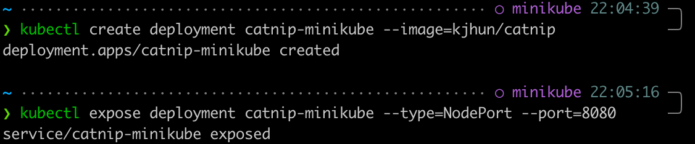

```zsh
# catnip-minikube Deployment 실행 확인 
kubectl get services quasar-minikube
```

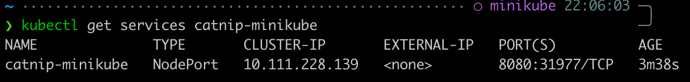

```zsh
# minikube로 웹 브라우저 실행
minikube service quasar-minikube
```

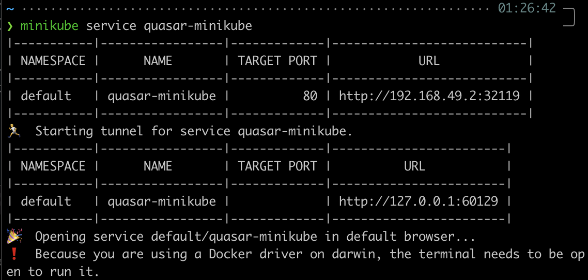

```zsh
# kubectl을 사용하요 포트포워딩 
kubectl port-forward service/quasar-minikube 9080:80
```

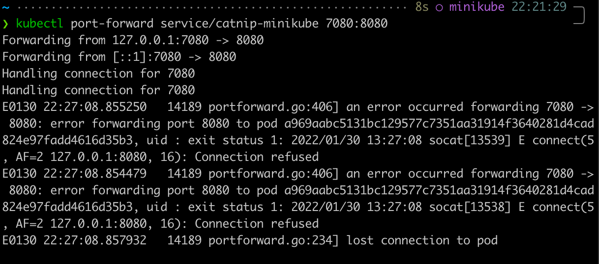

<http://localhost:9080/>

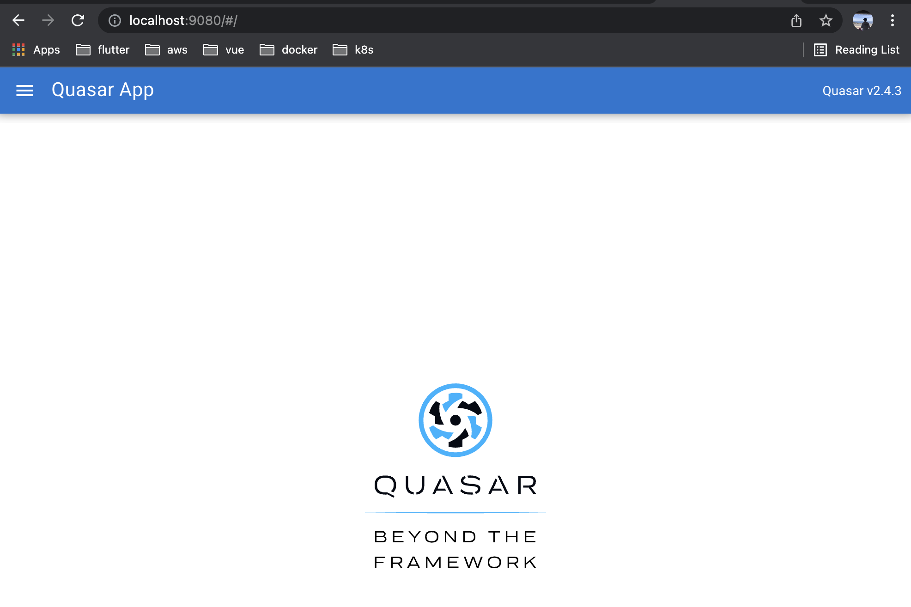

```zsh
# LoadBalancer Deployment
kubectl create deployment balanced --image=k8s.gcr.io/echoserver:1.4
kubectl expose deployment balanced --type=LoadBalancer --port=80
```

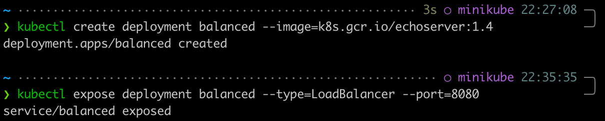

```zsh
# balanced deployment를 위한 routable IP 생성
minikube tennel
```

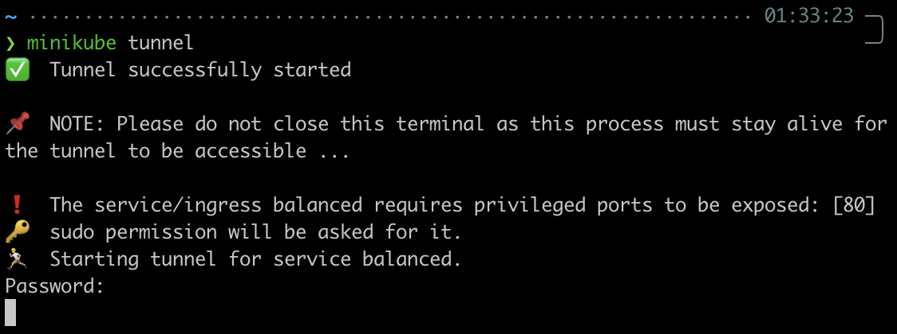

```zsh
# EXTERNAL-IP 확인
kubectl get services balanced
```

*EXTERNAL-IP:9080 에서 Deployment 사용가능*
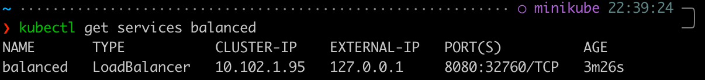

#### 5. Cluster 관리

```zsh
# 배포된 애플리케이션에 영향 없이 k8s 일시중지
minikube pause

# 일시중지 해제
minikube unpause

# 클러스터 중지
minikube stop

# 기본 메모리 설정 / 다시 시작할때 적용 됨 
minikube config set memory 16384

# 쉽게 설치할 수 있는 k8s service 목록 
minikube addons list

# 예전 k8s release로 클러스터 생성 실행 
minikube start -p aged --kubernetes-version=v1.16.1

# minikube cluster 모두 삭제 
minikube delete --all
```

---

## Reference

* [Minikube start](https://minikube.sigs.k8s.io/docs/start/)
