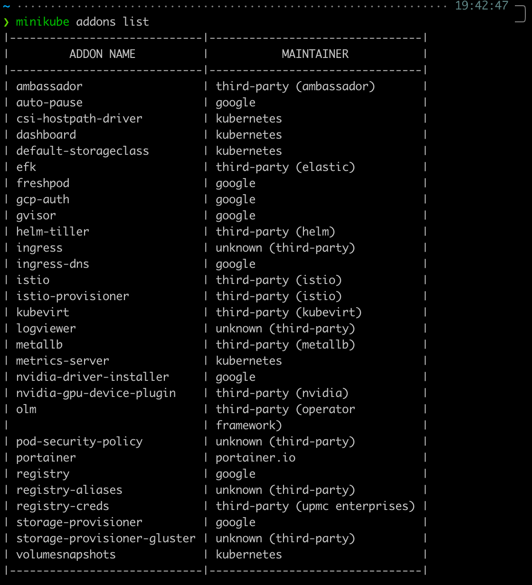
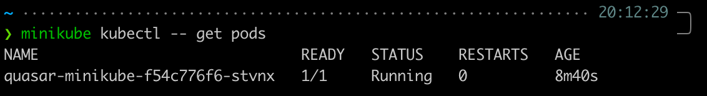
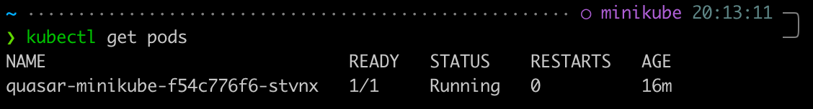
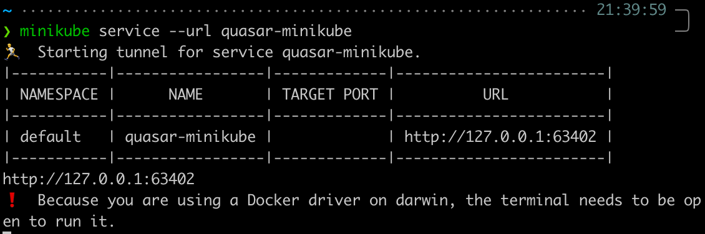
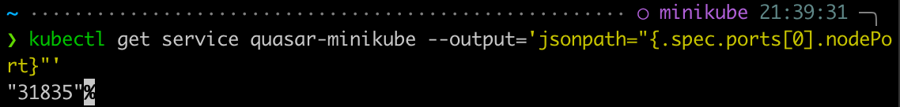
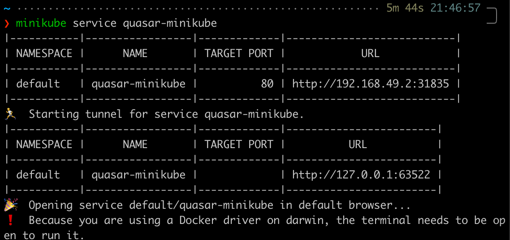

# Handbook

## Basic controls

```zsh
# 1. cluster 실행 :
minikube start

# 2. minikube cluster 내에서 실행되는 k8s dashboard 
minikube dashboard

# 3. kubectl을 사용하여 cluster와 상호작용
kubectl create deployment hello-minikube --image=k8s.gcr.io/echoserver:1.4

# 4. NodePort로 service expose
kubectl expose deployment hello-minikube --type=NodePort --port=8080

# 5. minikube를 사용하여 브라우저에 노출된 엔드포인트 expose
minikube service hello-minikube

# 6. cluster 업그레이드 
minikube start --kubernetes-version=latest

# 7. 두번째 로컬 클러스터 시작
minikube start -p cluster2

# stop, delete, delete --all
minikube stop
minikube delete
minikube delete --all
```

---

## Deploying apps

### kubectl

```zsh
kubectl create deployment hello-minikube1 --image=k8s.gcr.io/echoserver:1.4
kubectl expose deployment hello-minikube1 --type=LoadBalancer --port=8080
```

### Addons

minikube에는 Istio or Ingress와 같이 쉽게 배포할 수 있는 Application과 service 제공 목록이 있음

```zsh
# 1. 사용중인 미니큐브 버전에 사용 가능한 추가 기능 리스트
minikube addons list
```



```zsh
# 2. 추가기능 사용
minikube addons enable <name>

# 3. minikube 시작 시 추가기능 사용하기 위해 --addons옵션 사용 (여러 번 사용 가능)
minikube start --addons <name1> --addons <name2>

# 4. 브라우저를 표시하는 추가 프로그램의 경우 다음을 사용하여 빠르게 오픈 
minikube addons open <name>

# 5. 추가기능 사용하지 않기
minikube addons disable <name>
```

---

## Kubectl

* 기본적으로 kubectl은 minikube start가 실행될 때 minikube 내부의 kubernetes 클러스터 제어부에 액세스하도록 구성됨
* kubectl이 설치되어있지 않아도 minikube에 kubectl이 포함되어 있음

```zsh
minikube kubectl -- <kubectl commands>
```

```zsh
# 1. get pods
minikube kubectl -- get
kubectl get pods
```




---

## Accession apps

minikube 내에서 실행되는 application에 액세스 하는 방법

* NodePort
* LoadBalancer

### NodePort Access

* 외부 트래픽을 서비스로 직접 가져오는 가장 기본적인 방법
* 특정 포트를 열고 해당 포트로 전송되는 모든 트래픽을 서비스에 전달

```zsh
# minikube service 명령어로 NodePort 가져오기
minikube service --url <service-name>

# kubectl service 명령어로 NodePort 가져오기
kubectl get service <service-name> --output='jsonpath="{.spec.ports[0].nodePort}"'

# minikube service
minikube service <service-name>
```





```zsh
# minikube는 port 30000 ~ 32767 만을 표시
# 문제가 해결되지 않은 경우 다음을 사용하여 범위 조정 가능
minikube start --extra-config=apiserver.service-node-port-range=1-65535
```

### LoadBalancer access

* 인터넷에 서비스를 노출하는 표준 방법
* 각 서비스 자체 IP 주소를 얻을 수 있음

---

## Reference

* [Minikube handbook](https://minikube.sigs.k8s.io/docs/handbook/)
