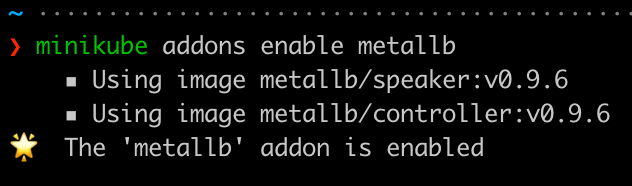
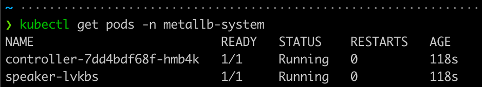
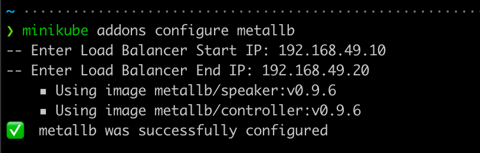
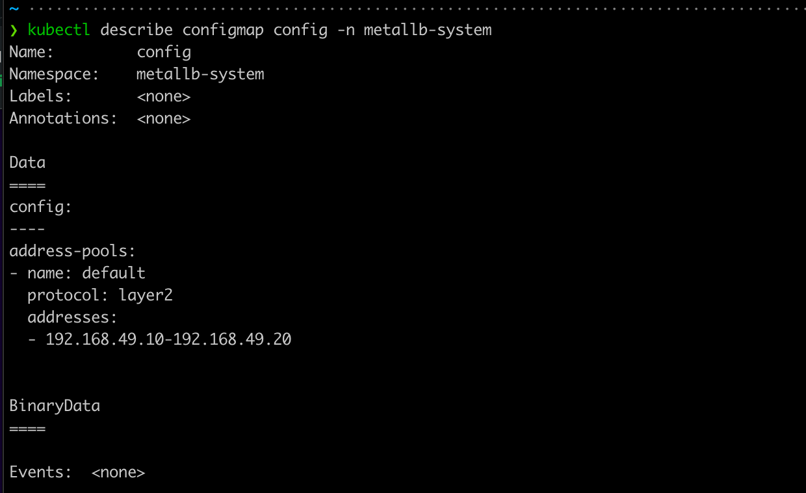
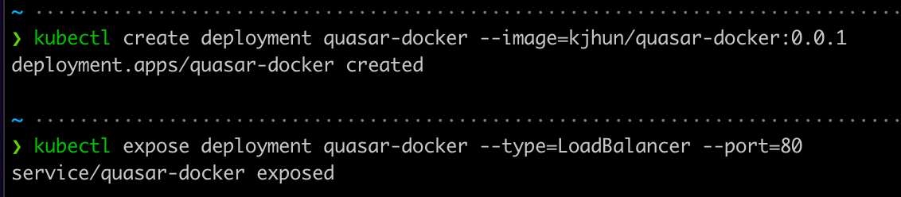
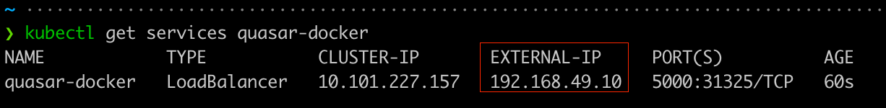
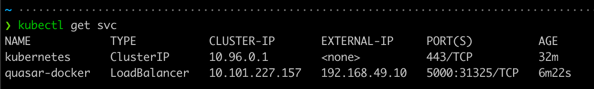
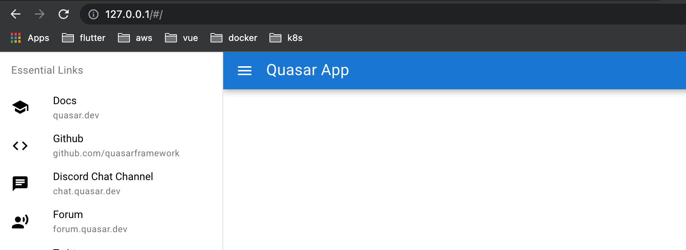
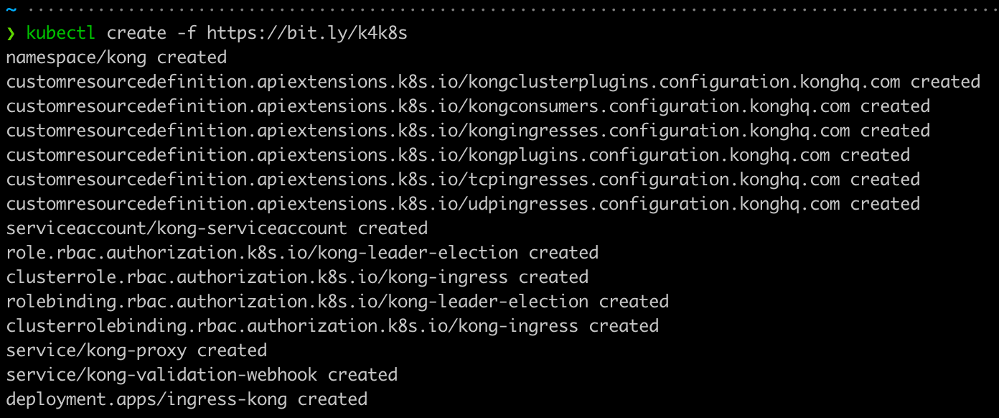
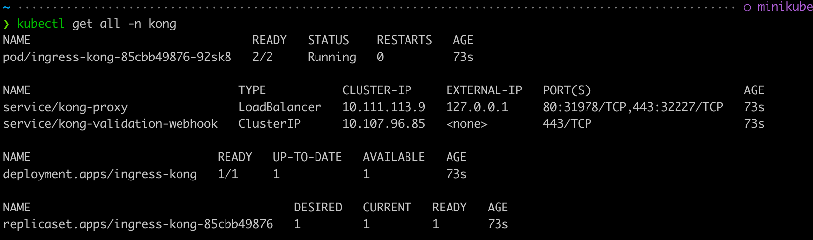

# Kong Ingress

```zsh
minikube start
```

## MetalLB Configuration

### MetalLB?

온프레미스에서 로드밸런서를 사용하려면 내부에 로드밸런서 서비스를 받아주는 구성이 필요한데, 이를 지원하는 것이 metallb 이다. 베어메탈(bare metal, 운영체제가 설치되지 않은 하드웨어)로 구성된 쿠버네티스에서도 로드밸런서를 사용할 수 있게 고안된 프로젝트이다.

(1) metallb 활성화

```zsh
minikube addons enable metallb
```



(2) 컴포넌트 확인

metallb addon이 활성화 되면 클러스터에서 metallb-system 네임스페이스로 가동되어 실행되는 두개의 컴포넌트를 확인할 수 있다.

```zsh
kubectl get pods -n metallb-system
```



controller는 IP주소 할당하고 speaker는 layer-2 주소를 보급한다.  

(3) metallb 구성

minikube ip를 확인하고 그에 맞는 IP 범위를 설정한다.

```zsh
minikube ip

minikube addons configure metallb
```



(4) 구성된 metallb 확인

```zsh
kubectl describe configmap config -n metallb-system
```



---

## Kong Ingress on minikube

```zsh
kubectl create deployment quasar-docker --image=kjhun/quasar-docker:0.0.1

kubectl expose deployment quasar-docker --type=LoadBalancer --port=80
```



```zsh
# 다른 터미널
minikube tunnel
```

```zsh
# EXERNAL-IP
kubectl get services quasar-docker

kubectl get svc
```





### Kubernetes Ingress Controller 배포

* kubectl을 사용하여 k8s ingress controller 배포
* CRD, Service Account, Cluster 역할 및 바인딩 배포

```zsh
kubectl create -f https://bit.ly/k4k8s
```



* 몇 분 후에 외부 LoadBalancer IP 주소를 사용하여 Kong-proxy 서비스를 시작할 수 있음

```zsh
kubectl get all -n kong
```



---

### Reference

[KongIngress - Minikube](https://minikube.sigs.k8s.io/docs/handbook/addons/kong-ingress/) 💩

[Kong Ingress - Kong](https://docs.konghq.com/kubernetes-ingress-controller/2.1.x/deployment/minikube/)

[MetalLB?](https://thebook.io/080241/ch03/03/04/)

[Kong Ingress as API Gateway on Minikube](https://faun.pub/kong-ingress-as-api-gateway-on-minikube-4269954aca5) 👏

[MetalLB Configuration in Minikube — To enable Kubernetes service of type “LoadBalancer”](https://faun.pub/metallb-configuration-in-minikube-to-enable-kubernetes-service-of-type-loadbalancer-9559739787df)
