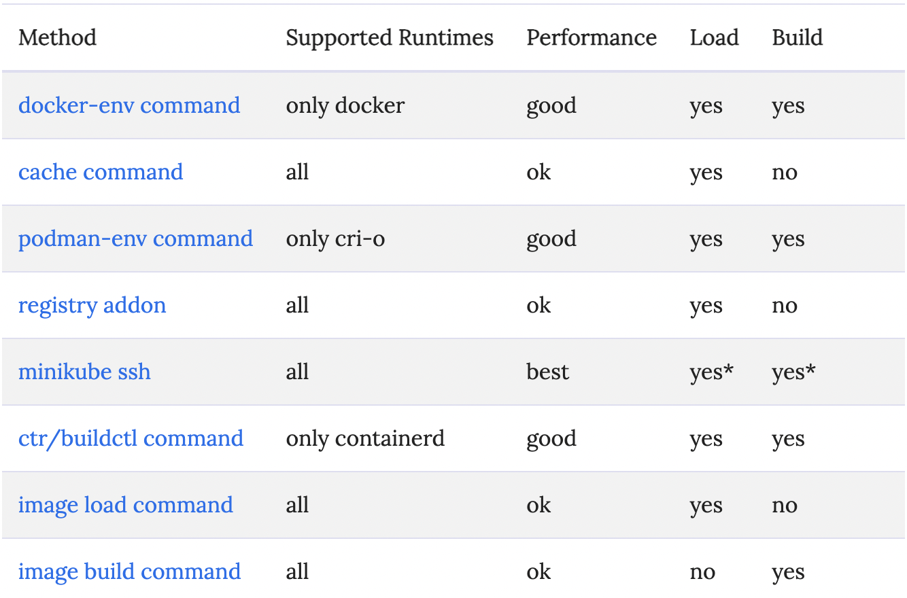
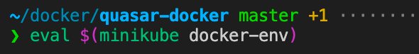
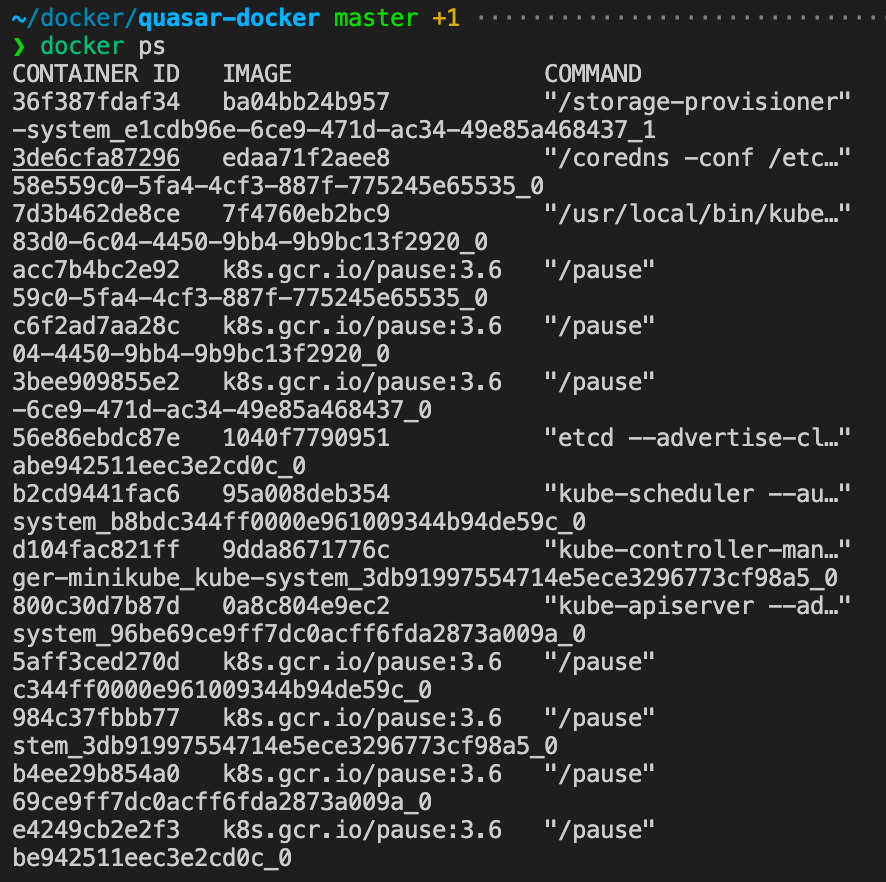
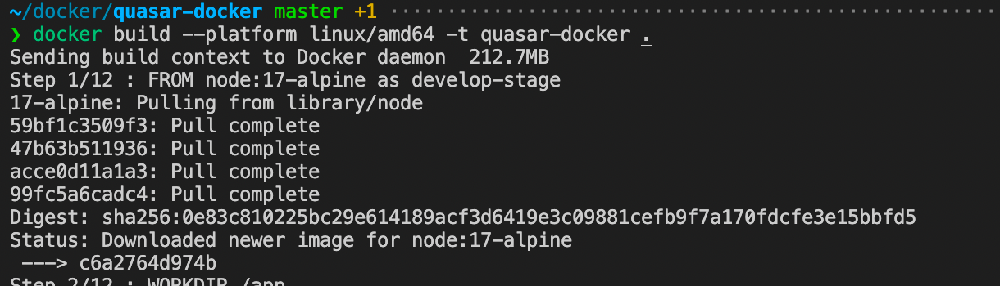
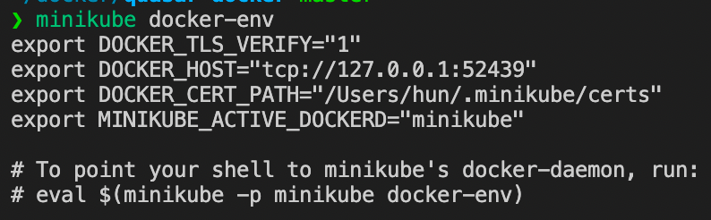

# Handbook 3

## Configuration

### start 명령어에서 사용할 수 있는 플래그 확인

```zsh
minikube start --help
```

### 영구적인 Configuration

* config명령을 사용하여 profiles에서 사용될 기본 값을 지정할 수 있음
* 속성 이름과 속성값 제공

```zsh
minikube config set driver hyperkit

# 영구적인 config 확인
minikube config view
```

### k8s configuration

* k8s 버전 선택

```zsh
minikube start --kubernetes-version=v1.11.10
```

### feature gates

* alpha / experimental features 활성화 및 비활성화
* Key=Value 형식의 문자열 사용

```zsh
minikube start --feature-gates=EphemeralContainers=true
```

### k8s 기본값 수정

* Key=Value 형식의 문자열 사용
* kubeadm
* apiserver
* controlloer-manager
* scheduler

```zsh
minikube start --extra-config=apiserver.v=10 --extra-config=kubelet.max-pods=100

minikube start --extra-config=kubeadm.ignore-preflight-errors=SystemVerification
```

### Runtime Configuration

```zsh
minikube start --container-runtime=docker
```

---

## Dashboard

* k8s dashboard UI
* 컨테이너 형 애플리케이션을 k8s 클러스터에 배포
* 컨테이너 형 애플리케이션 troubleshoot
* 클러스터 리소스 관리
* 클러스터에서 실행중인 애플리케이션 확인
* 개별 k8s 리소스 생성 또는 수정
* 배포크기 조정 / 롤링 업데이트 / pods 재시작/ 배포마법사를 통한 배포

```zsh
minikube dashboard

# 웹 브라우저를 열지 않고 URL 만 가져오기
minikube dashboard --url
```

---

## Pushing images

### Minikube cluster로 이미지 push하는 8가지 방법

```text
# 용어
* pull : 원격 registry에서 직접 컨테이너 이미지를 다운로드 하는 것
* push : 원격 registry에 컨테이너 업로드
* load : Archive에 저장한 이미지를 가져와 클러스터에서 사용
* save : Archive에 이미지 저장
* build : build context를 가져와 클러스터에 이미지 생성
* tag : 이름과 태그 할당
```

#### 클러스터를 구성한 컨테이너 실행 시간에 따른 적합한 푸시 방법



* 미니큐브의 기본 컨테이너는 'docker'
* none driver 이미지는 클러스터에 푸시할 필요가 없음
* ssh를 사용하여 명령을 실행할 때 로드 또는 로드한 파일이 클라이언트 호스트 뿐만 아니라 노드에서 이미 사용가능해야 함

#### 1. 클러스터 docker daemon(docker-env)에 직접 푸시

* 컨테이너 또는 VM 드라이버를 사용할 때 미니큐브 클러스터 내에서 docker daemon을 재사용할 수 있음
* docker daemon 내부에 구축하여 로컬 실험 속도를 향상

```zsh
# 미니큐브 실행
minikube start

# 미니큐브 안에서 docker daemon을 사용하도록 실행
# 현재 터미널에서 실행하는 모든 '도커' 명령은 미니큐브 클러스터 내의 도커에 대해 실행됨
eval $(minikube docker-env)

# 미니큐브 내부, VM 또는 컨테이너 내부에 있는 컨테이너를 표시
docker ps

# 미니큐브 내부의 도커에 대항하여 빌드
# 해당 도커는 k8s cluster에 즉시 접근 가능
docker build -t my_image .
```

docker-daemon


docker ps


build


터미널에서 Minikube docker-env가 사용중인지 확인을 위해 MINIKUBE_ACTIVE_DOCKERD 값을 확인


```text
tip1 
* imagePullPolicy 해제
* use imagePullPolicy:IfNotPresent or imagePullPolicy:Never
* 해제하지 않으면 k8s가 로컬 빌드 이미지가 아닌 네트워크에서 가져옴
```

```text
tip2
* docker-env는 현재 터미널에서만 유효
* 터미널을 닫으면 시스템 docker-daemon을 다시 사용
```

```text
tip3
* docker 혹은 podman과 같은 컨테이너 기반 드리이버 에선 클러스터를 다시 시작할 때마다 docker-env를 다시 실행해야 함
```
