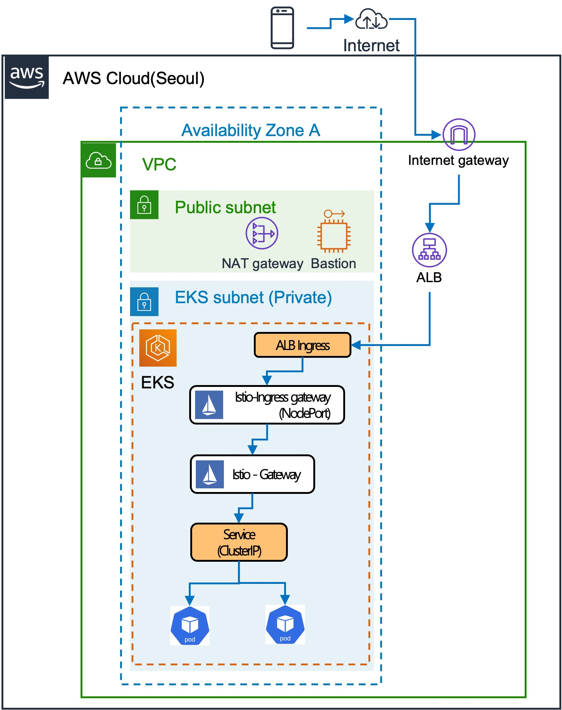

# EKS - Istio

## AWS 구성도



---

## Bastion

* 보안을 위해 고안된 호스트로 외부 네트워크와 내부 네트워크 사이 일종의 게이트웨이 역할을 수행
* eksctl cli를 설치하고 실행시킬 환경
* `bastion/00_eks_settings.sh`

### AWS CLI

* AWS configuration 설정

```bash
aws configure
AWS Access Key ID [None] : ***
AWS Secret Access Key [None] : ***
Default region name [None]: ap-northeast-2
Default output format [None]: json
```

### EKS

Amazon Elastic Kubernetes Service(Amazon EKS)는 클라우드 또는 온프레미스에서 `Kubernetes` 애플리케이션을 실행하고 크기를 조정하는 관리형 컨테이너 서비스

Cluster :

* 쿠버네티스에서 애플리케이션 컨테이너를 실행하기 위한 일련의 노드머신
* 쿠버네티스를 실행중이라면 클러스터를 실행하고 있는 것
* 최소 수준에서 컨트롤 플레인 및 하나 이상의 컴퓨터 머신 또는 노드를 포함
* 컨트롤플레인에서 클러스터를 원하는 상태로 유지 관리
* 노드에서 애플리케이션과 워크로드를 실제로 실행
* 머신 종류에 구애받지 않고 머신 그룹 전체에서 컨테이너를 예약하고 실행

Cluster 생성 :

* `01_create_esk_cluster.sh`

```bash
eksctl create cluster \
--version 1.21 \
--name eks-sample \
--node-private-networking \
--region ap-northeast-2 \
--node-type t3.medium \
--nodes 2 \
--with-oidc \
--ssh-access \
--ssh-public-key eks-sample-key \
--managed
```

* `node-private-networking` : node group이 private subnet에 만들어지도록 설정하는 옵션

EKS 보안 설정 :

* `02_private_access.sh

```bash
# cluster 생성 확인
kubectl get nodes -o wide

# optional - private access 설정
eksctl utils update-cluster-endpoints --cluster=eks-sample --private-access=true --public-access=true --approve
eksctl utils set-public-access-cidrs --cluster=eks-sample {bastion server pulic ip} --approve
```

* bastion 서버에서만 쿠버네티스 명령을 내릴 수 있도록 수정

### Istio

* MSA의 쿠버네티스에서 각 app들의 네트워크 연결을 쉽게 설정할 수 있도록 지원하는 기술
* Envoy를 Data Plane으로 사용하고 이를 컨트롤해주는 오픈소스 솔루션
* 쿠버네티스의 서비스메시(네트워크)관리에서 가장 많이 사용되는 오픈소스

Istio 설치 :

* `03_istio_namespace`

```bash
# istio-operator.yaml 생성
cat > istio-operator.yaml << EOF
apiVersion: install.istio.io/v1alpha1
kind: IstioOperator
metadata:
  namespace: istio-system
  name: istiocontrolplane
spec:
  profile: default
  components:
    egressGateways:
    - name: istio-egressgateway
      enabled: true
      k8s:
        hpaSpec:
          minReplicas: 2
    ingressGateways:
    - name: istio-ingressgateway
      enabled: true
      k8s:
        hpaSpec:
          minReplicas: 2
    pilot:
      enabled: true
      k8s:
        hpaSpec:
          minReplicas: 2
  meshConfig:
    enableTracing: true
    defaultConfig:
      holdApplicationUntilProxyStarts: true
    accessLogFile: /dev/stdout
    outboundTrafficPolicy:
      mode: REGISTRY_ONLY
EOF

istioctl install -f istio-operator.yaml

kubectl get pods -n istio-system
kubectl create namespace istio-sample
kubectl label namespace istio-sample istio-injection=enabled
```

* `ingressGateway` : 인바운드 트래픽 처리
* `egressGateway` : 아웃바운드 트래픽 처리
* `pilot` : CRD를 SidecarProxy가 이해할 수 있는 형식으로 변환 및 전파
* `outboundTrafficPolivy` : 허가된 IP/Domain만 outbound 허용
* `istio-injection=enabled` : 원하는 namespace 라벨을 추가하고 application 배포시 Envoy sidecar proxy를 주입하도록 설정
* istio-sample namespace에 배포하는 서비스는 istio-proxy가 sidecar로 같이 올라감

### ALB (Application Load Balancer)

* EKS에서 istio는 기본적으로 Classic Load Balancer(CLB)를 사용
* 권장사항은 Network Load Balancer(NLB) / ALB
* AWS WAF등을 사용하기 위해선 ALB

변경사항 :

* istio ingress gateway service type이 LoadBalancer에서 NodePort로 변경
* 기존 CLB 삭제
* 쿠버네티스 Ingress resource를 통해 ALB 생성
* ALB에서 모든 request를 istio ingress gateway pod보고 application service로 라우팅

ALB Controller 생성 :

* `04_alb_controller.sh`

```bash
aws iam list-policies

eksctl create iamserviceaccount \
  --cluster=eks-sample \
  --namespace=kube-system \
  --name=aws-load-balancer-controller \
  --attach-policy-arn=arn:aws:iam::000000000000:policy/AWSLoadBalancerControllerIAMPolicy \
  --override-existing-serviceaccounts \
  --approve

helm install aws-load-balancer-controller eks/aws-load-balancer-controller \
  -n kube-system \
  --set clusterName=eks-sample \
  --set serviceAccount.create=false \
  --set serviceAccount.name=aws-load-balancer-controller \
  --set image.repository=00000000000.dkr.ecr.ap-northeast-2.amazonaws.com/amazon/aws-load-balancer-controller

kubectl get deployment -n kube-system aws-load-balancer-controller
```

* ALB 생성을 위한 IAM Policy 설정
* 쿠버네티스의 Service Account 생성
* Helm을 사용하여 ALB Controller 설치

Istio 설정 변경 :

* `05_update_istio.sh`

```bash
# return istio port
kubectl get service istio-ingressgateway -n istio-system -o jsonpath='{.spec.ports[?(@.name=="status-port")].nodePort}'

cat > istio-operator-update.yaml << EOF
apiVersion: install.istio.io/v1alpha1
kind: IstioOperator
metadata:
  namespace: istio-system
  name: istiocontrolplane
spec:
  profile: default
  components:
    egressGateways:
    - name: istio-egressgateway
      enabled: true
      k8s:
        hpaSpec:
          minReplicas: 1
    ingressGateways:
    - name: istio-ingressgateway
      enabled: true
      k8s:
        hpaSpec:
          minReplicas: 1
        service:
          type: NodePort # ingress gateway 의 NodePort 사용
        serviceAnnotations:  # Health check 관련 정보
          alb.ingress.kubernetes.io/healthcheck-path: /healthz/ready
          alb.ingress.kubernetes.io/healthcheck-port: "0000" # 위에서 얻은 port number를 사용
    pilot:
      enabled: true
      k8s:
        hpaSpec:
          minReplicas: 2
  meshConfig:
    enableTracing: true
    defaultConfig:
      holdApplicationUntilProxyStarts: true
    accessLogFile: /dev/stdout
    outboundTrafficPolicy:
      mode: REGISTRY_ONLY
EOF

# port 수정
vim istio-operator-update.yaml

istioctl install -f istio-operator-update.yaml
```

* istio ingress gateway 서비스 타입을 NodePort로 변경
* ALB가 health check를 위해 사용할 istio ingress gateway의 health check 관련 nodeport number를 받아옴
* CLB는 삭제됨

ALB 생성 :

* `create_alb.sh`

```bash
cat > kube-ingress.yaml << EOF
apiVersion: extensions/v1beta1
kind: Ingress
metadata:
  name: ingress-alb
  namespace: istio-system
  annotations:
    kubernetes.io/ingress.class: alb
    alb.ingress.kubernetes.io/scheme: internet-facing
    alb.ingress.kubernetes.io/certificate-arn: "arn:aws:acm:ap-northeast-2:000000000000:certificate/***"
    alb.ingress.kubernetes.io/actions.ssl-redirect: '{"Type": "redirect", "RedirectConfig": { "Protocol": "HTTPS", "Port": "443", "StatusCode": "HTTP_301"}}'
spec:
  rules:
  - http:
      paths:
        - path: /*
          backend:
            serviceName: ssl-redirect
            servicePort: use-annotation
        - path: /*
          backend:
            serviceName: istio-ingressgateway
            servicePort: 80
EOF

kubectl apply -f kube-ingress.yaml
```

* 쿠버네티스 ingress를 통해 ALB 생성
* certificate-arn 에는 AWS ACM에 생성한 TLS certificate ARN 입력
* ALB 생성 완료
